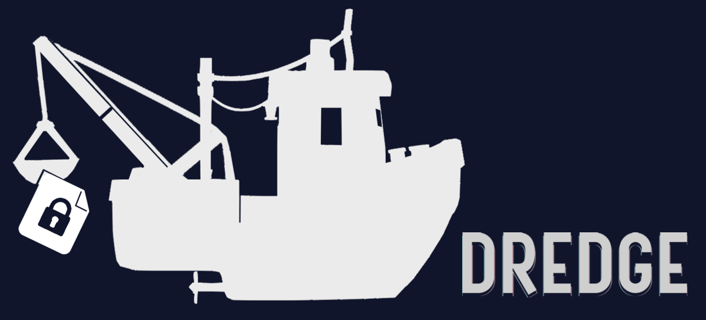

<div align="center">
  
</div>

<br>

This is NOT a password manager. NOT a notes app. NOT a deep-sea benthic abberant specimen taxonomic provenance registry. But it does the first two better than either. Just kidding (not really).

## Think of it as a backed-up personal _encrypted_ vault for the terminal. Dump anything and everything in. Get it back instantly.

<div align="center">
  <a href="https://github.com/DeprecatedLuar/dredge/stargazers">
    
  </a>
  <a href="LICENSE">
    
  </a>
  <a href="https://github.com/DeprecatedLuar/dredge/releases">
    
  </a>
</div>

---


---

<!-- You:
    AWS key is in 1Password. Your SSH config can't live in your dotfiles — it's sensitive. Your 7 email passwords are _somewhere_ you just gotta find it. AI prompts are in Notion and Google docs. Env vars are in another repo.

 Me (weakest dredge user):
    has SSH configs, API keys for a dozen services, business SOPs, AI prompts, crypto wallet recovery codes, Thunderbird backups, environment variables, and a '_legal_' copy of Chainsaw Man in Japanese in a single backed up location.  -->

Dredge is the one place instead of all of those. Encrypted, searchable, always with you.

[experience tranquility]

# The workflow:

```bash
dredge add aws
dredge aws
dredge system prompt
```

That's it. You don't have to organize, that creates mental overhead over time resulting in stress and fragmentation "where did I put that" effect. You just search when you need it and it's there, I'm not kidding.

---

## Install

```bash
curl -sSL https://raw.githubusercontent.com/DeprecatedLuar/dredge/main/install.sh | bash
```

<details>
<summary>Build from source (requires Go 1.21+)</summary>

<br>

```bash
git clone https://github.com/DeprecatedLuar/dredge
cd dredge
go build -o dredge ./cmd/dredge
mv dredge /usr/local/bin/
```
</details>

Git sync requires the [gh CLI](https://cli.github.com/) authenticated.

<details>
<summary>Quick start</summary>

<br>

```bash
# Initialize with a GitHub repo (creates it if it doesn't exist)
dredge init yourusername/vault

# Add your first item
dredge add "OpenAI Key" -c "sk-..." -t keys api #opens the editor without -c flag

# Search for it
dredge search openai

# Push to git
dredge push
```
</details>

<details>
<summary>Usage</summary>

<br>

```bash
# Add anything
dredge add My SSH Config -t ssh dotfiles --import ~/.ssh/config
dredge add "Master Architect Prompt" --import prompt.md -t ai prompts
dredge add "Watchlist" -c "Dune 2, Oppenheimer..." -t lists
dredge add "project-backup" --import project.tar.gz   # binary files too :D

# Search — just type whatever you remember
dredge search prompt
dredge search aws key
dredge search ssh

# View, edit, remove
dredge view <id>
dredge edit <id>
dredge rm <id>
dredge undo          # brought it back

# Search results are numbered — just type the number to view
dredge search ssh    # shows: 1. [xKP] SSH Config  2. [mNq] SSH Key
dredge 1             # views it directly

# Git sync
dredge push
dredge pull
dredge sync          # pull + push
```
</details>

---

## The cool features you've never seen before


- **Encrypted storage** — AES-256-GCM + Argon2id, everything encrypted at rest
- **Instant search** — fuzzy matching, typo-tolerant, I wanted something to read my mind when searching
- **Store anything** — text, secrets, files, binaries, literally anything
- **Live file linking** — symlink any item to a system path, edits sync both ways automatically (this feature is genuinely underrated by myself)
- **Git-backed** — your vault lives in a private repo you own, pull it on any machine
- **Session password** — prompted once per terminal session, never written to disk permanently
- **Trash + undo** — nothing is permanently gone until you want it to be

---

## What to store in dredge?

I have no clue what YOU want to store. The flexibility is the point. But to give you an idea:

- API keys and credentials (the ones that are only shown once)
- SSH keys and configs
- AI system prompts
- Passwords
- Scripts and snippets you keep rewriting
- Email templates you always retype
- Config files and dotfiles
- Binary files — zip a folder, store it, pull it anywhere
- Book and movie lists
- Anything you've Googled more than once
- A _legal_ copy of Chainsaw Man chapter 2 in Japanese

---

## Security

- AES-256-GCM encryption
- Argon2id key derivation
- Password cached per terminal session in `/run` — gone when the session ends
- Nothing decrypted to disk unless you explicitly link it
- Private git repo — you own the storage, no accounts, no telemetry, no cloud service

---

## All commands

<div align="left">

| Command | Description |
|:--------|:------------|
| add / a / new / + | Add an item (opens editor if no -c flag) |
| search / s | Search items |
| list / ls | List all items |
| view / v | View an item |
| edit / e | Edit an item |
| rm | Remove (goes to trash) |
| undo | Restore last removed item |
| link / ln | Link item to a system path |
| unlink | Remove a link |
| mv / rename | Rename item ID |
| export | Export a file item to disk |
| push / pull / sync | Git sync |
| status | Show pending changes |
| passwd | Change vault password |
| update | Update to latest version |

</div>

---

## The link command

Link any stored item to a path on your filesystem:

```bash
dredge link <id> ~/.ssh/config
```

Creates a symlink at `~/.ssh/config` pointing to a plain-text copy dredge manages. Edit the file directly or through `dredge edit` — changes sync back to the encrypted store automatically.

On a new machine:

```bash
git clone git@github.com:you/vault.git ~/.local/share/dredge
dredge link <id> ~/.ssh/config
# done — same SSH config, same keys, every machine
```

This is the reason I built dredge. My SSH config is identical on every machine, encrypted in git, and I never think about it.

---

## Why

Basically mental overhead of having to save something and never knowing when I will have to find it.

I got tired of having important things scattered everywhere — password manager for passwords, note app for notes, a separate dotfiles repo, a `notes.txt` on the desktop. Every tool does one thing and you end up managing the tools instead of the information.

I wanted something that just works. No organization to maintain, no fragmentation. Dump it in, find it when you need it, done.

[jrnl](https://jrnl.sh) pointed me in the right direction but wasn't very QoL leaning — It literally had no item separation and a search that matched *everything* Dredge is what I actually wanted. (so yeah pretty much a personal tool)

> **Note:** Currently requires GitHub via the `gh` CLI. Local-only mode and support for other git providers are planned.
