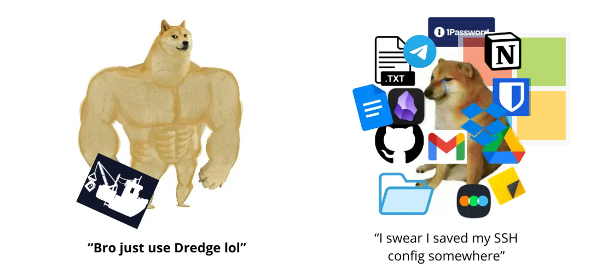
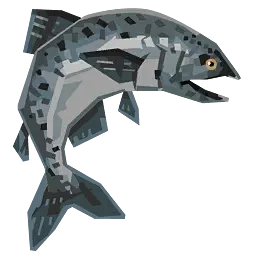
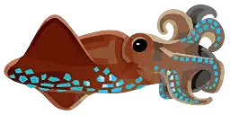
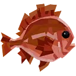
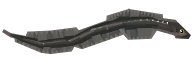
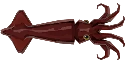
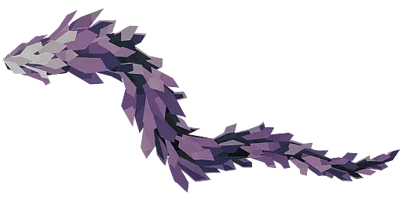

> This is NOT a password manager. NOT a notes app. And definetely NOT a deep-sea benthic abberant specimen taxonomic provenance registry. But it does the first two better than either. Just kidding (not really).

<div align="center">


<div align="center">

[Install](#install) • [Quick Start](#quick-start) • [Features](#the-cool-features-youve-never-seen-before) • [The Link Command](#the-link-command) • [Commands](#all-commands) • [How It Works](#how-it-works) • [Security](#security) • [Why](#why)

</div>

</div>

<div align="center">

Search, don't organize. **_Notes, configs, keys, secrets_** — five seconds from your terminal.

</div>

<div align="center">
  <a href="https://github.com/DeprecatedLuar/dredge/stargazers">
    
  </a>
  <a href="LICENSE">
    
  </a>
  <a href="https://github.com/DeprecatedLuar/dredge/releases">
    
  </a>
</div>


---

<div align="center">
<!-- demo gif -->

</div>

```bash
go install github.com/DeprecatedLuar/dredge/cmd/dredge@latest
```

<div align="right">

[other install options ↓](#install)

</div>

---

<h2> The cool features you've never seen before</h2>

- **Encrypted storage** — Clone the repo and get absolute cryptic gibberish. Useless without your password. (AES-256-GCM + Argon2id)
- **Instant search** — fuzzy, typo-tolerant. Type what you remember, not what you saved.
- **Store anything** — notes, scripts, dotfiles, images, zip archives. If it's a file, it goes in.
- **Live file linking** — symlink any item to a system path. Edit directly or through dredge — changes sync both ways.
- **Git-backed** — private repo you own. `git clone` it anywhere and you have everything.
- **Session password** — one prompt per terminal session. After that, it stays out of your way.
- **Trash + undo** — deleted items go to trash. So `dredge undo` brings them back.

---

<h2> What to store in dredge?</h2>

Dredge doesn't judge. API keys shown only once, SSH configs, AI prompts, passwords, scripts you keep rewriting, email templates you always retype, dotfiles, zip archives, movie lists, anything you've Googled more than once.

Even a _legal_ copy of Chainsaw Man chapter 2 in Japanese.

---

<h2> Install</h2>

**If you have Go:**

```bash
go install github.com/DeprecatedLuar/dredge/cmd/dredge@latest
```

Make sure `$GOPATH/bin` (usually `~/go/bin`) is in your `PATH`.

<details>
<summary>No Go? Use the install script</summary>

<br>

Downloads a pre-built binary — no Go required. The script delegates to [the-satellite](https://github.com/DeprecatedLuar/the-satellite), a reusable installer library I use across projects for OS/arch detection and binary downloads.

```bash
curl -sSL https://raw.githubusercontent.com/DeprecatedLuar/dredge/main/install.sh | bash
```

</details>

<details>
<summary>Build from source</summary>

<br>

```bash
git clone https://github.com/DeprecatedLuar/dredge
cd dredge
go build -o dredge ./cmd/dredge
mv dredge ~/.local/bin/
```

</details>


Git sync requires the [gh CLI](https://cli.github.com/) authenticated. (For now. I'll work on that before v1.0)

---

<h2> Quick start</h2>

```bash
# Initialize with a GitHub repo (creates it if it doesn't exist)
dredge init yourusername/vault

# Add your first item
dredge add "OpenAI Key" -c "sk-..." -t keys api #opens the editor without -c flag

# Search for it
dredge search openai

# Push to git
dredge push
```

<details>
<summary>Usage</summary>

<br>

```bash
# Add anything
dredge add My SSH Config -t ssh dotfiles --import ~/.ssh/config
dredge add "Master Architect Prompt" --import prompt.md -t ai prompts
dredge add "Watchlist" -c "Dune 2, Oppenheimer..." -t lists
dredge add "project-backup" --import project.tar.gz   # binary files too :D

# Search — just type whatever you remember
dredge search prompt
dredge search aws key
dredge search ssh

# View, edit, remove
dredge view <id>
dredge edit <id>
dredge rm <id>
dredge undo          # brought it back

# Search results are numbered — just type the number to view
dredge search ssh    # shows: 1. [xKP] SSH Config  2. [mNq] SSH Key
dredge 1             # views it directly

# Git sync
dredge push
dredge pull
dredge sync          # pull + push
```
</details>

---

<h2> How it works</h2>

Dredge stores everything as encrypted files in `~/.local/share/dredge/`. That directory is also a git repository — so `dredge push` just commits and pushes it. Each item is a standalone encrypted blob with a random 3-character ID. No filenames, no readable metadata from the outside.

### The encryption pipeline

```
Your password
  + 16-byte random salt  ←  stored in .dredge-key
  → Argon2id (64 MB memory · 4 threads · 1 iteration)
  → 32-byte master key

Master key + item content (TOML: title, tags, content)
  → AES-256-GCM with a fresh random 12-byte nonce per operation
  → [12B nonce][ciphertext + 16B auth tag]
  → written to disk as items/xKP  (random ID, no extension)
```

One key per vault, derived fresh from your password each session. Every item uses the same key, each with its own random nonce — encrypting the same content twice produces completely different ciphertext.

### What lives where

```
~/.local/share/dredge/          ← the vault (also a git repo)
├── .git/
├── .gitignore                  ← excludes .spawned/ and links.json
├── .dredge-key                 ← salt + encrypted verification string  [git-tracked]
├── items/
│   ├── xKP                     ← encrypted item                        [git-tracked]
│   ├── mNq                     ← encrypted item                        [git-tracked]
│   └── ...
├── .spawned/                   ← plaintext copies of linked items      [git-ignored]
└── links.json                  ← symlink manifest                      [git-ignored]
```

Only encrypted files and `.dredge-key` ever leave your machine via git. Plaintext never touches the remote.

### Session model

After your first command in a terminal, the derived 32-byte key is cached at:

```
$XDG_RUNTIME_DIR/dredge/$PPID/.key
```

Subsequent commands in the same terminal use the cached key — no password prompt. Each terminal gets its own isolated directory via parent PID. Close the terminal, the key is gone.

<details>
<summary>Deeper technical details</summary>

<br>

**Key derivation — Argon2id:** RFC 9106 recommended parameters (64 MB memory, 4 threads, 1 iteration). The salt in `.dredge-key` is not secret — it just ensures brute-forcing your password is expensive even with the file. A strong password is your real protection.

**Cipher — AES-256-GCM:** Authenticated encryption. Provides both confidentiality and integrity — a tampered ciphertext won't silently decrypt to garbage, decryption will fail and error.

**Password verification:** `.dredge-key` contains the string `dredge-vault-v1` encrypted with your master key. On each new session, dredge decrypts this to verify your password before touching any items — fast-failing in ~100ms rather than discovering a wrong password mid-operation.

**What's cached:** The session file stores the derived 32-byte key, not the password. So even if someone reads `.key` during an active session, they cannot recover your password from it.

</details>

---

<h2> Security</h2>

### Threat model

**Someone clones your private git repo:**
They get encrypted blobs and `.dredge-key`. The salt is not secret — its purpose is to make precomputation attacks impractical. Without your password, the items are opaque binary data. Argon2id makes offline brute-force expensive. Use a strong password.

**Someone has access to your running session:**
The derived key lives in `$XDG_RUNTIME_DIR/dredge/$PPID/.key` for the duration of that terminal session. Each terminal gets its own isolated directory — close the terminal, the key is gone. That path is user-scoped (mode 700) and RAM-backed. An attacker with read access to your session directory can decrypt your vault. Treat it like any sensitive credential in your home directory. If someone has root on your machine, your dredge key is the least of your concerns.

**Someone has physical access to your offline machine:**
Items on disk are encrypted. The session key is in RAM-backed storage and does not survive a reboot. Linked items (`.spawned/`) are plaintext on disk — see below.

### Where plaintext exists

| Location | When | Lifetime |
|----------|------|---------|
| RAM only | Every view, search, or edit | Freed when command exits |
| `$XDG_RUNTIME_DIR/dredge/$PPID/edit-*.txt` | During `dredge edit` only | Deleted after editor closes |
| `~/.local/share/dredge/.spawned/<id>` | After `dredge link` | Until you run `dredge unlink` |

The spawned file is the only persistent plaintext on disk, and it only exists because you explicitly linked an item to a system path. Everything else is in-memory only.

### Caveats

- **`--password` flag:** Passing your password inline exposes it in shell history and `ps` output. Avoid it in shared environments.
- **Linked items:** A linked item's plaintext lives at the symlink target (e.g. `~/.ssh/config`). It is not git-tracked, but it is on disk in plaintext.

<div align="center">

</div>

<h2> The link command</h2>

Link any stored item to a path on your filesystem:

```bash
dredge link <id> ~/.ssh/config
```

Creates a symlink at `~/.ssh/config` pointing to a plain-text copy dredge manages. Edit the file directly or through `dredge edit` — changes sync back to the encrypted store automatically.

On a new machine:

```bash
git clone git@github.com:you/vault.git ~/.local/share/dredge
dredge link <id> ~/.ssh/config
# done — same SSH config, same keys, every machine
```

This is the reason I built dredge. My SSH config is identical on every machine, encrypted in git, and I never think about it.

---

<h2> All commands</h2>

<div align="left">

| Command | Description | Example |
|:--------|:------------|:--------|
| `add` / `a` / `new` / `+` | Add an item (opens editor if no -c flag) | `dredge add "OpenAI Key" -c "sk-..." -t keys` |
| `search` / `s` | Search items | `dredge search aws key` |
| `list` / `ls` | List all items | `dredge ls` |
| `view` / `v` | View an item | `dredge view xKP` or `dredge 1` |
| `edit` / `e` | Edit an item | `dredge edit xKP` |
| `rm` | Remove (goes to trash) | `dredge rm 1 2 3` |
| `undo` | Restore last removed item | `dredge undo` |
| `link` / `ln` | Link item to a system path | `dredge link xKP ~/.ssh/config` |
| `unlink` | Remove a link | `dredge unlink xKP` |
| `mv` / `rename` | Rename item ID | `dredge mv xKP abc` |
| `export` | Export a file item to disk | `dredge export xKP ./output/` |
| `push` / `pull` / `sync` | Git sync | `dredge sync` |
| `status` | Show pending changes | `dredge status` |
| `passwd` | Change vault password | `dredge passwd` |
| `update` | Update to latest version | `dredge update` |

</div>

---

<h2> Why</h2>

The mental overhead of saving something and not knowing where to find it when you need it.

I got tired of having important things scattered everywhere — password manager for passwords, note app for notes, a separate dotfiles repo, a `notes.txt` on the desktop. Every tool does one thing and you end up managing the tools instead of the information.

I wanted something that just works. No organization to maintain, no fragmentation. Dump it in, find it when you need it, done.

[jrnl](https://jrnl.sh) pointed me in the right direction but wasn't very QoL leaning — it literally had no item separation and a search that matched *everything*. Dredge is what I actually wanted. (so yeah, pretty much a personal tool)

<div align="center">

</div>
